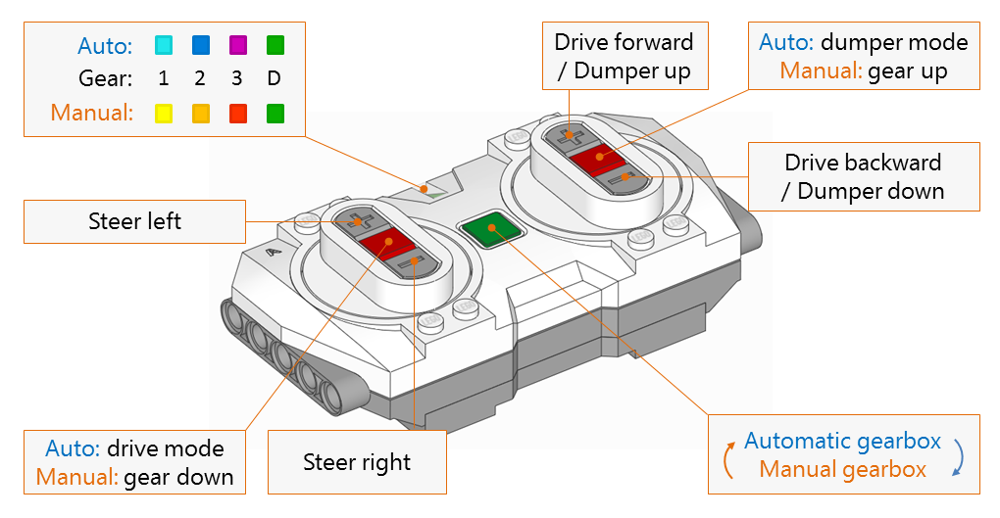
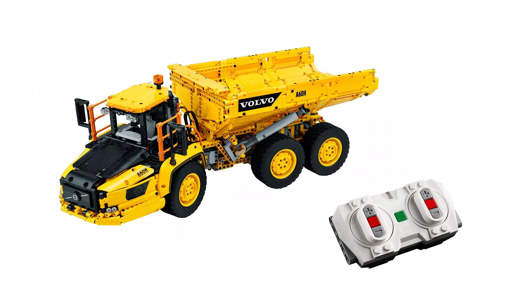

# Controlling LEGO Volvo Articulated Hauler (42114) with Bluetooth Remote (88010)

## Installation 

Go to https://beta.pybricks.com/, and paste the code of main.py. In "Settings and help" (gear icon on the right) enable "Include current program" in Firmware section. Push and hold the button on the Technic Hub until it starts to blink in violet. Then press "Install Pybricks Firmware" button in beta.pybricks.com site (on the left of Bluetooth button), still holding the hub's button. Pair Bluetooth with "LEGO Bootloader" (it should appear in the pop up window's list), and when when the progress bar appears, you can release button on the Technic Hub. After new firmware is uploaded, the program can be used without Bluetooth connection with programming environment at https://beta.pybricks.com/.

## Connecting with remote 

To run the program, push the Technic Hub button to make hub's LED blink in blue. Then push green button on the remote, to make connection to the hub. After successful connection, remote's LED color changes to blue. Then gearbox is callibrated, remote LED color changes to cyan and hauler is ready to drive.

## Driving and switching gears

By default left controller controlls left/right steering, and right controller determines direction of driving. This can be changed easily by setting constant `LEFT_STEER_RIGHT_DRIVE` to False.

Gearbox can be used in two modes, as in the original LEGO smartphone app: *automatic* and *manual*. You can switch between the modes by pushing the green button on the remote. *Automatic* is default starting mode, but this can be easily changed by modifying constant `INIT_GEARBOX_AUTO`.

In the *automatic* mode, gears are changed when program detects that motor's speed is too slow or close to maximum speed. Current gear is indicated by the color of LED - 1: cyan, 2: blue, 3: magenta. To enable dumper (LED: green), press right red button on the remote. To go back to driving mode, press left red button. If drive is idle for time longer than defined in constant `GEAR_RESET_TIMEOUT`, the gear is set to 1.

In the *manual* mode gear is decreased by pressing left red button, and increased with right red button. Gearbox positions are indicated by the color of LED: 1: yellow, 2: orange, 3: red, Dumper: green.

## How does it work?

Automatic gearbox measures speed of XL motor, when it is running. If the speed is very low or close to maximum for long enough time, the gear is changed. To make speed measurement resistant to random variations, the values obtained from speed sensor are filtered using simple exponential smoothing. Threshold values of speed, measurement time and smoothing constant are defined by constants `HI_SPEED, LO_SPEED`, `STABLE_SPEED_TIME` and `SMOOTHING`.

